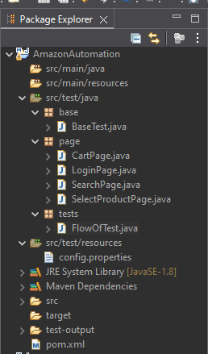

# 🛒 E-Commerce Automation (Amazon)

This project demonstrates end-to-end automation of a user journey flow on Amazon using **Java, Selenium WebDriver, and TestNG**.  
It covers login, product search, product selection, add-to-cart, checkout, and dummy payment details entry.

---

## 🔹 Project Structure


---

## 🎯 Goal
To automate a complete user flow on an e-commerce platform as part of the **JungleWorks Automation Assignment**.

---

## 🚀 Automated Flow
- Open Amazon website  
- Log in with valid credentials (from `config.properties`)  
- Search for a product (e.g., *bag*)  
- Select a product from search results  
- Add the product to the cart  
- Proceed to checkout  
- Choose **Credit/Debit Card** as payment method  
- Enter dummy card details (from `config.properties`)  

---

## 🛠️ Tech Stack
- **Language:** Java  
- **Framework:** Selenium WebDriver + TestNG  
- **Build Tool:** Maven  
- **Browser:** Chrome (managed via ChromeDriver)  

---

## ⚙️ Prerequisites
- Install **Java 11+**  
- Install **Maven**  
- Install **Chrome Browser**  
- Clone this repository and open in **Eclipse/IntelliJ** as a Maven project  

---

## 🔑 Configuration
Update `src/test/resources/config.properties` with your test data:

```properties
email=your_email@gmail.com
password=your_password
cardNo=4111111111111111
```
## ▶️ How to Run

### Run via IDE
1. Open the project in **Eclipse/IntelliJ**  
2. Run **`tests/FlowOfTest.java`** as **TestNG Test**  

---

## ✅ Expected Output
- Browser launches **Amazon**  
- Logs in with provided credentials  
- Searches for product (**bag**)  
- Selects and adds item to **cart**  
- Proceeds to **checkout**  
- Selects **Credit/Debit Card** option  
- Enters **dummy card details**  
- Logs messages in **console** for each step  


---

## 🔹 Proof of Execution

- **Video Recording** – https://drive.google.com/file/d/1X08GARW6MHy4RS99sAEJOzVUrVuaFXMO/view?usp=sharing 

---
## 📸 Deliverables
- **GitHub Link** – [AmazonAutomation](https://github.com/Prince0207200/AmazonAutomation)  
- **README** – Setup & execution guide (this file)  
- **Video Recording** – [Execution Demo](https://drive.google.com/file/d/1X08GARW6MHy4RS99sAEJOzVUrVuaFXMO/view?usp=sharing)  
- **Code Quality** – Can be re-run on any system with minimal config changes  

---

## ⚡ Notes
- Uses **explicit waits** to handle dynamic elements and iframes  
- No real payment required (**dummy card used**)  
- Code structured using **Page Object Model (POM)** for maintainability  

